# datamodel-code-generator

🚀 Generate Python data models from schema definitions in seconds.

🧪 Try it in your browser: [Playground](https://datamodel-code-generator.koxudaxi.dev/playground/)

> [!NOTE]
> Playground privacy: generation runs locally in your browser with Pyodide. Schemas and options are not sent to a
> backend. Shared repro URLs encode them in the URL fragment (`#state=...`), which browsers do not send to the server;
> the full URL can still be stored in your browser history or wherever you share it.

[](https://pypi.python.org/pypi/datamodel-code-generator)
[](https://anaconda.org/conda-forge/datamodel-code-generator)
[](https://pepy.tech/projects/datamodel-code-generator)
[](https://pypi.python.org/pypi/datamodel-code-generator)
[](https://codecov.io/gh/koxudaxi/datamodel-code-generator)

[](https://pydantic.dev)

> 📣 💼 Maintainer update: Open to opportunities. 🔗 [koxudaxi.dev](https://koxudaxi.dev/?utm_source=github_readme&utm_medium=top&utm_campaign=open_to_work)

## ✨ What it does

<!-- Source of truth: docs/assets/diagrams/hero.mmd — regenerate with `tox run -e diagrams` -->
<p align="center">
  <picture>
    <source media="(prefers-color-scheme: dark)" srcset="docs/assets/diagrams/hero-dark.svg">
    
  </picture>
</p>

Pick any one of the supported inputs and pick the Python model style you want as output.
`--input-model path/to/file.py:ClassName` can even retarget an existing Pydantic, dataclass, or TypedDict class defined
in another Python file to a different output type.

- 📄 Converts **OpenAPI 3**, **AsyncAPI**, **JSON Schema**, **Apache Avro**, **XML Schema**, **Protocol Buffers/gRPC**, **GraphQL**, **MCP tool schemas**, and raw data (JSON/YAML/CSV) into Python models
- 🐍 Generates from **existing Python types** (Pydantic, dataclass, TypedDict) via `--input-model`
- 🎯 Generates **Pydantic v2**, **Pydantic v2 dataclass**, **dataclasses**, **TypedDict**, or **msgspec** output
- 🔗 Handles complex schemas: `$ref`, `allOf`, `oneOf`, `anyOf`, enums, and nested types
- ✅ Produces type-safe, validated code ready for your IDE and type checker

---

## 📖 Documentation

**👉 [datamodel-code-generator.koxudaxi.dev](https://datamodel-code-generator.koxudaxi.dev)**

- 🖥️ [CLI Reference](https://datamodel-code-generator.koxudaxi.dev/cli-reference/) - All command-line options
- 🧪 [Playground](https://datamodel-code-generator.koxudaxi.dev/playground/) - Try generation in your browser
- ⚙️ [pyproject.toml](https://datamodel-code-generator.koxudaxi.dev/pyproject_toml/) - Configuration file
- 🔄 [CI/CD Integration](https://datamodel-code-generator.koxudaxi.dev/ci-cd/) - GitHub Actions, pre-commit hooks
- 🚀 [One-liner Usage](https://datamodel-code-generator.koxudaxi.dev/oneliner/) - uvx, pipx, clipboard integration
- ❓ [FAQ](https://datamodel-code-generator.koxudaxi.dev/faq/) - Common questions

---

## Coding agent skill

This repository includes an experimental Agent Skill that teaches compatible coding agents to run `datamodel-codegen` when generating Python models from OpenAPI, AsyncAPI, JSON Schema, GraphQL, JSON/YAML/CSV sample data, MCP tool schemas, Protocol Buffers, XML Schema, Apache Avro, or existing Python model objects.

See [Coding Agent Skill](docs/coding-agent-skill.md) for detailed guidance and troubleshooting.

Install the directory for your agent:

```bash
# Codex, project-local
mkdir -p .agents/skills
cp -R skills/datamodel-code-generator .agents/skills/datamodel-code-generator

# Claude Code, project-local
mkdir -p .claude/skills
cp -R skills/datamodel-code-generator .claude/skills/datamodel-code-generator
```

For a personal install, copy the same directory to `$HOME/.agents/skills/datamodel-code-generator/` for Codex or `~/.claude/skills/datamodel-code-generator/` for Claude Code.

Check your agent's current documentation for exact search paths.

---

## 📦 Installation

Recommended for standalone CLI use:

```bash
uv tool install datamodel-code-generator
```

For projects that should pin the generator version, add it as a development dependency instead:

```bash
uv add --dev datamodel-code-generator
```

<details>
<summary>Other installation methods</summary>

**pip:**
```bash
pip install datamodel-code-generator
```

**uv (run without adding to project):**
```bash
uv run --with datamodel-code-generator datamodel-codegen --help
```

**conda:**
```bash
conda install -c conda-forge datamodel-code-generator
```

**With HTTP support** (for resolving remote `$ref`):
```bash
pip install 'datamodel-code-generator[http]'
```

**With GraphQL support:**
```bash
pip install 'datamodel-code-generator[graphql]'
```

**With Protocol Buffers support:**
```bash
pip install 'datamodel-code-generator[protobuf]'
```

**Docker:**
```bash
docker pull koxudaxi/datamodel-code-generator
```

</details>

---

## 🏃 Quick Start

```bash
datamodel-codegen --input schema.json --input-file-type jsonschema --output-model-type pydantic_v2.BaseModel --output model.py
```

<details>
<summary>📄 schema.json (input)</summary>

```json
{
  "$schema": "http://json-schema.org/draft-07/schema#",
  "title": "Pet",
  "type": "object",
  "required": ["name", "species"],
  "properties": {
    "name": {
      "type": "string",
      "description": "The pet's name"
    },
    "species": {
      "type": "string",
      "enum": ["dog", "cat", "bird", "fish"]
    },
    "age": {
      "type": "integer",
      "minimum": 0,
      "description": "Age in years"
    },
    "vaccinated": {
      "type": "boolean",
      "default": false
    }
  }
}
```

</details>

<details>
<summary>🐍 model.py (output)</summary>

```python
# generated by datamodel-codegen:
#   filename:  schema.json

from __future__ import annotations

from enum import Enum
from typing import Optional

from pydantic import BaseModel, Field


class Species(Enum):
    dog = 'dog'
    cat = 'cat'
    bird = 'bird'
    fish = 'fish'


class Pet(BaseModel):
    name: str = Field(..., description="The pet's name")
    species: Species
    age: Optional[int] = Field(None, description='Age in years', ge=0)
    vaccinated: Optional[bool] = False
```

</details>

---

## 📥 Supported Input

- OpenAPI 3 (YAML/JSON)
- AsyncAPI (YAML/JSON)
- JSON Schema
- Apache Avro schema (AVSC)
- XML Schema (XSD)
- Protocol Buffers / gRPC (`.proto`)
- MCP tool schemas
- JSON / YAML / CSV data
- GraphQL schema
- Python types (Pydantic, dataclass, TypedDict) via `--input-model`
- Python dictionary

## 📤 Supported Output

- [pydantic v2](https://docs.pydantic.dev/) BaseModel
- [pydantic v2](https://docs.pydantic.dev/) dataclass
- [dataclasses](https://docs.python.org/3/library/dataclasses.html)
- [TypedDict](https://docs.python.org/3/library/typing.html#typing.TypedDict)
- [msgspec](https://github.com/jcrist/msgspec) Struct

---

## 🍳 Common Recipes

### 🤖 Get CLI Help from LLMs

Generate a prompt to ask LLMs about CLI options:

```bash
datamodel-codegen --generate-prompt "Best options for Pydantic v2?" | claude -p
```

See [LLM Integration](https://datamodel-code-generator.koxudaxi.dev/llm-integration/) for more examples.

### 🌐 Generate from URL

```bash
pip install 'datamodel-code-generator[http]'
datamodel-codegen --url https://example.com/api/openapi.yaml --output model.py
```

### ⚙️ Use with pyproject.toml

```toml
[tool.datamodel-codegen]
input = "schema.yaml"
output = "src/models.py"
output-model-type = "pydantic_v2.BaseModel"
```

Then simply run:

```bash
datamodel-codegen
```

See [pyproject.toml Configuration](https://datamodel-code-generator.koxudaxi.dev/pyproject_toml/) for more options.

### 🔄 CI/CD Integration

Validate generated models in your CI pipeline:

```yaml
- uses: koxudaxi/datamodel-code-generator@0.44.0
  with:
    input: schemas/api.yaml
    output: src/models/api.py
```

See [CI/CD Integration](https://datamodel-code-generator.koxudaxi.dev/ci-cd/) for more options.

---

## 💖 Sponsors

<table>
  <tr>
    <td valign="top" align="center">
      <a href="https://github.com/astral-sh">
        
        <p>Astral</p>
      </a>
    </td>
    <td valign="top" align="center">
      <a href="https://github.com/openai">
        
        <p>OpenAI</p>
      </a>
    </td>
  </tr>
</table>

---

## 🏢 Projects that use datamodel-code-generator

These projects use datamodel-code-generator. See the linked examples for real-world usage.

- [PostHog/posthog](https://github.com/PostHog/posthog) - *[Generate models via npm run](https://github.com/PostHog/posthog/blob/e1a55b9cb38d01225224bebf8f0c1e28faa22399/package.json#L41)*
- [airbytehq/airbyte](https://github.com/airbytehq/airbyte) - *[Generate Python, Java/Kotlin, and Typescript protocol models](https://github.com/airbytehq/airbyte-protocol/tree/main/protocol-models/bin)*
- [apache/iceberg](https://github.com/apache/iceberg) - *[Generate Python code](https://github.com/apache/iceberg/blob/d2e1094ee0cc6239d43f63ba5114272f59d605d2/open-api/README.md?plain=1#L39)*
- [open-metadata/OpenMetadata](https://github.com/open-metadata/OpenMetadata) - *[datamodel_generation.py](https://github.com/open-metadata/OpenMetadata/blob/main/scripts/datamodel_generation.py)*
- [openai/codex](https://github.com/openai/codex) - *[Python SDK dev dependency](https://github.com/openai/codex/blob/cca36c5681d16c7dac6e3f385589b8cd4d3e78cd/sdk/python/pyproject.toml#L32-L33)*
- [vllm-project/vllm](https://github.com/vllm-project/vllm) - *[Test dependency for model tests](https://github.com/vllm-project/vllm/blob/main/requirements/test.in)*
- [stanfordnlp/dspy](https://github.com/stanfordnlp/dspy) - *[Generate Pydantic models from JSON Schema for reliability tests](https://github.com/stanfordnlp/dspy/blob/main/tests/reliability/generate/utils.py)*
- [topoteretes/cognee](https://github.com/topoteretes/cognee) - *[Runtime generation of graph data models from JSON Schema](https://github.com/topoteretes/cognee/blob/main/cognee/shared/graph_model_utils.py)*
- [e2b-dev/E2B](https://github.com/e2b-dev/E2B) - *[Generate MCP server TypedDict models via Makefile](https://github.com/e2b-dev/E2B/blob/main/packages/python-sdk/Makefile)*
- [apache/airflow](https://github.com/apache/airflow) - *[Generate OpenAPI datamodels for airflow-ctl and task-sdk via pyproject codegen config](https://github.com/apache/airflow/blob/f1ac27af8b53e7d3ca7ff710c4f4413599bd1535/airflow-ctl/pyproject.toml#L148-L172)*
- [browser-use/browser-use](https://github.com/browser-use/browser-use) - *[Eval dependency](https://github.com/browser-use/browser-use/blob/de14b9aa31d167696a7ea7185d71876dbd7e6c94/pyproject.toml#L74-L79)*
- [firebase/genkit](https://github.com/firebase/genkit) - *[Generate core typing models from JSON Schema](https://github.com/firebase/genkit/blob/main/py/bin/generate_schema_typing)*
- [open-telemetry/opentelemetry-python](https://github.com/open-telemetry/opentelemetry-python) - *[Generate SDK configuration dataclasses from JSON Schema](https://github.com/open-telemetry/opentelemetry-python/blob/main/tox.ini)*
- [DataDog/integrations-core](https://github.com/DataDog/integrations-core) - *[Config models](https://github.com/DataDog/integrations-core/blob/master/docs/developer/meta/config-models.md)*
- [argoproj-labs/hera](https://github.com/argoproj-labs/hera) - *[Makefile](https://github.com/argoproj-labs/hera/blob/c8cbf0c7a676de57469ca3d6aeacde7a5e84f8b7/Makefile#L53-L62)*
- [tensorzero/tensorzero](https://github.com/tensorzero/tensorzero) - *[Generate Python dataclasses from JSON Schema in the schema generation pipeline](https://github.com/tensorzero/tensorzero/blob/26a51c8808f64cc0beaf8db4dfeea646cffbdaaa/crates/tensorzero-python/generate_schema_types.py#L1-L26)*
- [IBM/compliance-trestle](https://github.com/IBM/compliance-trestle) - *[Building models from OSCAL schemas](https://github.com/IBM/compliance-trestle/blob/develop/docs/contributing/website.md#building-the-models-from-the-oscal-schemas)*

[See all dependents →](https://github.com/koxudaxi/datamodel-code-generator/network/dependents)

---

## 🔗 Related Projects

- **[fastapi-code-generator](https://github.com/koxudaxi/fastapi-code-generator)** - Generate FastAPI app from OpenAPI
- **[pydantic-pycharm-plugin](https://github.com/koxudaxi/pydantic-pycharm-plugin)** - PyCharm plugin for Pydantic

---

## 🤝 Contributing

See [Development & Contributing](https://datamodel-code-generator.koxudaxi.dev/development-contributing/) for how to get started!

---

## 👤 Maintainer

[Koudai Aono](https://koxudaxi.dev/?utm_source=github_readme&utm_medium=maintainer_section&utm_campaign=open_to_work) ([@koxudaxi](https://github.com/koxudaxi))

---

## 📄 License

MIT License - see [LICENSE](LICENSE) for details.
