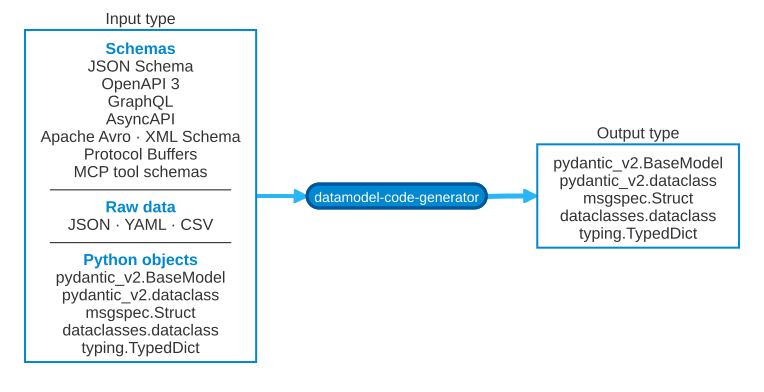

# datamodel-code-generator

🚀 Generate Python data models from schema definitions in seconds.

📚 [Documentation](https://datamodel-code-generator.koxudaxi.dev/) ·
🧪 [Playground](https://datamodel-code-generator.koxudaxi.dev/playground/) ·
💼 [Lead maintainer available for work](https://koxudaxi.dev/?utm_source=github_readme&utm_medium=top&utm_campaign=open_to_work)

> [!NOTE]
> Playground privacy: Generation runs locally in your browser with Pyodide. Your schema and options are not sent to a
> backend. Shared repro URLs encode them in the URL fragment (`#state=...`), which browsers do not send to the server;
> the full URL can still be stored in your browser history or wherever you share it.

[](https://pypi.python.org/pypi/datamodel-code-generator)
[](https://anaconda.org/conda-forge/datamodel-code-generator)
[](https://pepy.tech/projects/datamodel-code-generator)
[](https://pypi.python.org/pypi/datamodel-code-generator)
[](https://codecov.io/gh/koxudaxi/datamodel-code-generator)

[](https://pydantic.dev)

## ✨ What it does

<!-- Source of truth: docs/assets/diagrams/hero.mmd — regenerate with `tox run -e diagrams` -->
<p align="center">
  <picture>
    <source media="(prefers-color-scheme: dark)" srcset="docs/assets/diagrams/hero-dark.svg">
    
  </picture>
</p>

Pick any one of the supported inputs and pick the Python model style you want as output.
`--input-model path/to/file.py:ClassName` can even retarget an existing Pydantic, dataclass, or TypedDict class defined
in another Python file to a different output type.

- 📄 Converts **OpenAPI 3**, **AsyncAPI**, **JSON Schema**, **Apache Avro**, **XML Schema**, **Protocol Buffers/gRPC**, **GraphQL**, **MCP tool schemas**, and raw data (JSON/YAML/CSV) into Python models
- 🐍 Generates from **existing Python types** (Pydantic, dataclass, TypedDict) via `--input-model`
- 🎯 Generates **Pydantic v2**, **Pydantic v2 dataclass**, **dataclasses**, **TypedDict**, or **msgspec** output
- 🔗 Handles complex schemas: `$ref`, `allOf`, `oneOf`, `anyOf`, enums, and nested types
- ✅ Produces type-safe, validated code ready for your IDE and type checker

---

## 📦 Installation

Recommended for standalone CLI use:

```bash
uv tool install datamodel-code-generator
```

Conda users can install from conda-forge:

```bash
conda install -c conda-forge datamodel-code-generator
```

For projects that should pin the generator version, add it as a development dependency instead:

```bash
uv add --dev datamodel-code-generator
```

> [!NOTE]
> Community-maintained distribution packages are also available from
> [Debian](https://packages.debian.org/search?keywords=datamodel-codegen&searchon=names&suite=all&section=all),
> [Ubuntu](https://packages.ubuntu.com/search?keywords=datamodel-codegen&searchon=names&suite=all&section=all),
> [nixpkgs](https://search.nixos.org/packages?query=datamodel-code-generator), and
> [openSUSE Tumbleweed](https://software.opensuse.org/package/python-datamodel-code-generator).
> Availability and versions vary by distribution.

<details>
<summary>Other installation methods</summary>

**pip:**
```bash
pip install datamodel-code-generator
```

**uv (run without adding to project):**
```bash
uv run --with datamodel-code-generator datamodel-codegen --help
```

**With stable HTTP support** (for resolving remote `$ref`):
```bash
pip install 'datamodel-code-generator[http]'
```

The `http` extra is supported and is not deprecated. To require the experimental
HTTPX2 backend instead, install `datamodel-code-generator[httpx2]` and pass
`--http-backend httpx2`. The experimental extra is not included in
`datamodel-code-generator[all]`. See
[HTTP backend selection](https://datamodel-code-generator.koxudaxi.dev/faq/#http-backend-selection)
for automatic and explicit selection behavior.

**With GraphQL support:**
```bash
pip install 'datamodel-code-generator[graphql]'
```

**With Protocol Buffers support:**
```bash
pip install 'datamodel-code-generator[protobuf]'
```

**Docker:**
```bash
docker pull koxudaxi/datamodel-code-generator
```

Published Docker images run as a non-root `appuser`. When writing generated files
to a bind-mounted directory, make sure the directory is writable by the container
user or pass an explicit Docker user, for example `--user "$(id -u):$(id -g)"`.

</details>

---

## 🏃 Quick Start

<!-- BEGIN AUTO-GENERATED PRESET QUICK START -->
**Command**

```bash
datamodel-codegen \
  --input schema.json \
  --input-file-type jsonschema \
  --output-model-type pydantic_v2.BaseModel \
  --preset standard-py312-20260619 \
  --output model.py
```

This quick start uses `standard-py312-20260619` as the modern Python 3.12 baseline.
Preset names include the target Python version: `py312` means Python 3.12.

See [CLI Reference](https://datamodel-code-generator.koxudaxi.dev/cli-reference/) for all options. See [Presets](https://datamodel-code-generator.koxudaxi.dev/presets/),
[`--preset`](https://datamodel-code-generator.koxudaxi.dev/cli-reference/base-options/#preset), [`--input-file-type`](https://datamodel-code-generator.koxudaxi.dev/cli-reference/base-options/#input-file-type), and
[`--output-model-type`](https://datamodel-code-generator.koxudaxi.dev/cli-reference/model-customization/#output-model-type) for this command.

For more schema-aware output that preserves schema-authored names, reuses models, and embeds generated
documentation, use [`practical-py312-20260619`](https://datamodel-code-generator.koxudaxi.dev/presets/#practical-py312-20260619).

<details>
<summary>Input (<code>schema.json</code>)</summary>

```json
{
  "$schema": "http://json-schema.org/draft-07/schema#",
  "title": "Pet",
  "type": "object",
  "required": ["name"],
  "properties": {
    "name": {
      "type": "string",
      "description": "The pet's name"
    },
    "species": {
      "type": "string",
      "enum": ["dog", "cat", "bird", "fish"],
      "default": "dog"
    },
    "age": {
      "type": "integer",
      "minimum": 0,
      "description": "Age in years"
    },
    "vaccinated": {
      "type": "boolean",
      "default": false
    }
  }
}
```

</details>

**Output (`model.py`)**

```python
# generated by datamodel-codegen:
#   filename:  schema.json

from __future__ import annotations

from enum import StrEnum
from typing import Annotated

from pydantic import BaseModel, ConfigDict, Field


class Species(StrEnum):
    dog = 'dog'
    cat = 'cat'
    bird = 'bird'
    fish = 'fish'


class Pet(BaseModel):
    model_config = ConfigDict(
        populate_by_name=True,
    )
    name: Annotated[str, Field(description="The pet's name")]
    species: Species = Species.dog
    age: Annotated[int | None, Field(description='Age in years', ge=0)] = None
    vaccinated: bool = False
```

### ⚡ Speed up generation

By default, generated Python is currently formatted with `black` and `isort`. For faster generation without external
formatter dependencies, add `--formatters builtin` for standard generated model modules. In a future version, the
Black/isort dependencies will become opt-in and the default formatter will change to `builtin`.

If you prefer Ruff, install it with `pip install 'datamodel-code-generator[ruff]'` and use
`--formatters ruff-check ruff-format` for a fast external formatter.

Custom templates can emit Python outside the standard generated model patterns covered by `builtin`, so
custom-template output is not exhaustively validated. If `--formatters builtin` produces invalid or poorly formatted
output with a custom template, please open an issue with a small reproducer. See
[Formatter Behavior](https://datamodel-code-generator.koxudaxi.dev/formatter-behavior/) for details.

See [Performance Benchmarks](https://datamodel-code-generator.koxudaxi.dev/performance-benchmarks/) for release benchmark data and interactive charts.
<!-- END AUTO-GENERATED PRESET QUICK START -->

---

## 📖 Documentation

**👉 [Read the full documentation →](https://datamodel-code-generator.koxudaxi.dev/)**

- 🧰 [Presets](https://datamodel-code-generator.koxudaxi.dev/presets/) - Recommended option bundles for modern output
- 🚀 [Getting Started](https://datamodel-code-generator.koxudaxi.dev/getting-started/) - Installation and first model
- 🖥️ [CLI Reference](https://datamodel-code-generator.koxudaxi.dev/cli-reference/) - All command-line options
- 🧪 [Playground](https://datamodel-code-generator.koxudaxi.dev/playground/) - Try generation in your browser
- ⚙️ [pyproject.toml](https://datamodel-code-generator.koxudaxi.dev/pyproject_toml/) - Configuration file
- 🔄 [CI/CD Integration](https://datamodel-code-generator.koxudaxi.dev/ci-cd/) - GitHub Actions, pre-commit hooks
- ✅ [Conformance Dashboard](https://datamodel-code-generator.koxudaxi.dev/conformance/) - External corpus coverage signals
- 📈 [Performance Benchmarks](https://datamodel-code-generator.koxudaxi.dev/performance-benchmarks/) - Release benchmark tables and interactive charts
- 🧭 [Architecture](https://datamodel-code-generator.koxudaxi.dev/architecture/) - Generation pipeline and synchronized component inventory
- 🚀 [One-liner Usage](https://datamodel-code-generator.koxudaxi.dev/oneliner/) - uvx, pipx, clipboard integration
- ❓ [FAQ](https://datamodel-code-generator.koxudaxi.dev/faq/) - Common questions

---

## 📥 Supported Input

<!-- BEGIN AUTO-GENERATED README SUPPORTED INPUT -->
- OpenAPI 3 (YAML/JSON)
- AsyncAPI (YAML/JSON)
- JSON Schema
- MCP tool schemas
- XML Schema (XSD)
- Protocol Buffers / gRPC (`.proto`)
- Apache Avro schema (AVSC)
- JSON data
- YAML data
- Python dictionary
- CSV data
- GraphQL schema
- Python types (Pydantic, dataclass, TypedDict) via `--input-model`
<!-- END AUTO-GENERATED README SUPPORTED INPUT -->

## 📤 Supported Output

<!-- BEGIN AUTO-GENERATED README SUPPORTED OUTPUT -->
- [pydantic v2](https://docs.pydantic.dev/) BaseModel
- [pydantic v2](https://docs.pydantic.dev/) dataclass
- [dataclasses](https://docs.python.org/3/library/dataclasses.html)
- [TypedDict](https://docs.python.org/3/library/typing.html#typing.TypedDict)
- [msgspec](https://github.com/jcrist/msgspec) Struct
<!-- END AUTO-GENERATED README SUPPORTED OUTPUT -->

## ✅ Conformance Signals

CI exercises datamodel-code-generator against pinned external corpora for XML Schema, JSON Schema, AsyncAPI, Apache
Avro, and Protocol Buffers. See the [Conformance Dashboard](https://datamodel-code-generator.koxudaxi.dev/conformance/)
for the generated summary of runner scripts, tox environments, CI jobs, expected corpus counts, and upstream sources.

---

## 🍳 Common Recipes

<!-- BEGIN AUTO-GENERATED CLI RECIPE QUICK STARTS -->
### CLI option quick starts

Use these starting points when combining options; each option links to the generated CLI reference for details and examples.

- **Generate a local schema file:** Pin the input type and destination when the source extension is ambiguous or generated output needs a stable path. Options: [`--input`](https://datamodel-code-generator.koxudaxi.dev/cli-reference/base-options/#input), [`--input-file-type`](https://datamodel-code-generator.koxudaxi.dev/cli-reference/base-options/#input-file-type), [`--output`](https://datamodel-code-generator.koxudaxi.dev/cli-reference/base-options/#output).
- **Target Pydantic v2 on modern Python:** Set the output model family and Python/Pydantic compatibility targets together. Options: [`--output-model-type`](https://datamodel-code-generator.koxudaxi.dev/cli-reference/model-customization/#output-model-type), [`--target-python-version`](https://datamodel-code-generator.koxudaxi.dev/cli-reference/model-customization/#target-python-version), [`--target-pydantic-version`](https://datamodel-code-generator.koxudaxi.dev/cli-reference/model-customization/#target-pydantic-version).
- **Use modern Python annotations:** Target a recent Python version and prefer built-in collection and union syntax in generated types. Options: [`--target-python-version`](https://datamodel-code-generator.koxudaxi.dev/cli-reference/model-customization/#target-python-version), [`--use-union-operator`](https://datamodel-code-generator.koxudaxi.dev/cli-reference/typing-customization/#use-union-operator), [`--use-standard-collections`](https://datamodel-code-generator.koxudaxi.dev/cli-reference/typing-customization/#use-standard-collections).
- **Normalize incoming field names:** Convert source names to Python identifiers while preserving explicit alias data for runtime IO. Options: [`--snake-case-field`](https://datamodel-code-generator.koxudaxi.dev/cli-reference/field-customization/#snake-case-field), [`--original-field-name-delimiter`](https://datamodel-code-generator.koxudaxi.dev/cli-reference/field-customization/#original-field-name-delimiter), [`--aliases`](https://datamodel-code-generator.koxudaxi.dev/cli-reference/field-customization/#aliases).
- **Generate operation-focused models:** Limit OpenAPI output to operation shapes and name models from operation IDs and status codes. Options: [`--openapi-scopes`](https://datamodel-code-generator.koxudaxi.dev/cli-reference/openapi-only-options/#openapi-scopes), [`--use-operation-id-as-name`](https://datamodel-code-generator.koxudaxi.dev/cli-reference/openapi-only-options/#use-operation-id-as-name), [`--use-status-code-in-response-name`](https://datamodel-code-generator.koxudaxi.dev/cli-reference/openapi-only-options/#use-status-code-in-response-name).
- **Resolve remote references deliberately:** Enable remote `$ref` loading and configure request metadata, timeouts, or local ref roots. Options: [`--allow-remote-refs`](https://datamodel-code-generator.koxudaxi.dev/cli-reference/general-options/#allow-remote-refs), [`--http-headers`](https://datamodel-code-generator.koxudaxi.dev/cli-reference/general-options/#http-headers), [`--http-timeout`](https://datamodel-code-generator.koxudaxi.dev/cli-reference/general-options/#http-timeout), [`--http-local-ref-path`](https://datamodel-code-generator.koxudaxi.dev/cli-reference/general-options/#http-local-ref-path).

See the [CLI Reference](https://datamodel-code-generator.koxudaxi.dev/cli-reference/) for the full option list and category-specific recipes.
<!-- END AUTO-GENERATED CLI RECIPE QUICK STARTS -->

### 🤖 Get CLI Help from LLMs

Generate a prompt to ask LLMs about CLI options:

```bash
datamodel-codegen --generate-prompt "Best options for Pydantic v2?" | claude -p
```

See [LLM Integration](https://datamodel-code-generator.koxudaxi.dev/llm-integration/) for more examples.

### 🌐 Generate from URL

```bash
pip install 'datamodel-code-generator[http]'
datamodel-codegen --url https://example.com/api/openapi.yaml --output model.py
```

The `http` extra is the stable, non-deprecated backend. For the experimental
HTTPX2 alternative, pass `--http-backend httpx2`; see
[HTTP backend selection](https://datamodel-code-generator.koxudaxi.dev/faq/#http-backend-selection).

### ⚙️ Use with pyproject.toml

```toml
[tool.datamodel-codegen]
input = "schema.yaml"
output = "src/models.py"
output-model-type = "pydantic_v2.BaseModel"
```

Then simply run:

```bash
datamodel-codegen
```

See [pyproject.toml Configuration](https://datamodel-code-generator.koxudaxi.dev/pyproject_toml/) for more options.

### 🔄 CI/CD Integration

Validate generated models in your CI pipeline:

```yaml
# Replace vX.Y.Z with a released action version.
- uses: koxudaxi/datamodel-code-generator@vX.Y.Z
  with:
    input: schemas/api.yaml
    output: src/models/api.py
```

See [CI/CD Integration](https://datamodel-code-generator.koxudaxi.dev/ci-cd/) for more options.

---

## Coding agent skill

This repository includes an experimental Agent Skill that teaches compatible coding agents to run `datamodel-codegen` when generating Python models from OpenAPI, AsyncAPI, JSON Schema, GraphQL, JSON/YAML/CSV sample data, MCP tool schemas, Protocol Buffers, XML Schema, Apache Avro, or existing Python model objects.

See [Coding Agent Skill](docs/coding-agent-skill.md) for detailed guidance and troubleshooting.

Install the bundled skill directly from the CLI:

```bash
# Codex, project-local
datamodel-codegen --install-skill codex

# Claude Code, project-local
datamodel-codegen --install-skill claude-code
```

For a personal install, add `--skill-scope user`. Existing skills are preserved
unless you explicitly add `--overwrite-skill`.

Check your agent's current documentation for exact search paths.

---

## 💖 Sponsors

<table>
  <tr>
    <td valign="top" align="center">
      <a href="https://github.com/openai">
        
        <p>OpenAI</p>
      </a>
    </td>
  </tr>
</table>

---

## 🏢 Projects that use datamodel-code-generator

These public examples are grouped by how each project uses datamodel-code-generator.

### Code generation and runtime integration

- [openai/codex](https://github.com/openai/codex) - *[Generate public Python SDK types from protocol schemas](https://github.com/openai/codex/blob/205d37a20f742b0bf8e191622bd07c43f567ea49/sdk/python/scripts/update_sdk_artifacts.py#L558-L590)*
- [modelcontextprotocol/python-sdk](https://github.com/modelcontextprotocol/python-sdk) - *[Generate MCP protocol models from vendored JSON Schemas](https://github.com/modelcontextprotocol/python-sdk/blob/main/scripts/gen_surface_types.py)*
- [modular/modular](https://github.com/modular/modular) - *[Generate MAX Serve KServe schemas from OpenAPI with datamodel-codegen](https://github.com/modular/modular/blob/0735fa29762a5c53d65a0456d0b53eac1472180f/max/python/max/serve/schemas/README.md#L20-L33)*
- [apache/airflow](https://github.com/apache/airflow) - *[Generate OpenAPI datamodels for airflow-ctl and task-sdk via pyproject codegen config](https://github.com/apache/airflow/blob/f1ac27af8b53e7d3ca7ff710c4f4413599bd1535/airflow-ctl/pyproject.toml#L148-L172)*
- [PostHog/posthog](https://github.com/PostHog/posthog) - *[Generate Pydantic models from JSON Schema](https://github.com/PostHog/posthog/blob/master/bin/build-schema-python.sh#L5-L14)*
- [airbytehq/airbyte](https://github.com/airbytehq/airbyte) - *[Generate Python, Java/Kotlin, and Typescript protocol models](https://github.com/airbytehq/airbyte-protocol/tree/main/protocol-models/bin)*
- [open-metadata/OpenMetadata](https://github.com/open-metadata/OpenMetadata) - *[datamodel_generation.py](https://github.com/open-metadata/OpenMetadata/blob/main/scripts/datamodel_generation.py)*
- [topoteretes/cognee](https://github.com/topoteretes/cognee) - *[Runtime generation of graph data models from JSON Schema](https://github.com/topoteretes/cognee/blob/main/cognee/shared/graph_model_utils.py)*
- [e2b-dev/E2B](https://github.com/e2b-dev/E2B) - *[Generate MCP server TypedDict models via Makefile](https://github.com/e2b-dev/E2B/blob/main/packages/python-sdk/Makefile)*
- [DataDog/integrations-core](https://github.com/DataDog/integrations-core) - *[Config models](https://github.com/DataDog/integrations-core/blob/master/docs/developer/meta/config-models.md)*
- [open-telemetry/opentelemetry-python](https://github.com/open-telemetry/opentelemetry-python) - *[Generate SDK configuration dataclasses from JSON Schema](https://github.com/open-telemetry/opentelemetry-python/blob/main/tox.ini)*

### Development, testing, and evaluation

- [browser-use/browser-use](https://github.com/browser-use/browser-use) - *[Evaluation dependency](https://github.com/browser-use/browser-use/blob/de14b9aa31d167696a7ea7185d71876dbd7e6c94/pyproject.toml#L74-L79)*
- [vllm-project/vllm](https://github.com/vllm-project/vllm) - *[Test dependency for MiniCPM3 tests](https://github.com/vllm-project/vllm/blob/46f01a50acd6862806ed67b88176c96c2b161142/requirements/test/cuda.in#L40)*
- [stanfordnlp/dspy](https://github.com/stanfordnlp/dspy) - *[Generate Pydantic models from JSON Schema for reliability tests](https://github.com/stanfordnlp/dspy/blob/main/tests/reliability/generate/utils.py)*

[See all dependents →](https://github.com/koxudaxi/datamodel-code-generator/network/dependents)

---

## 🔗 Related Projects

- **[fastapi-code-generator](https://github.com/koxudaxi/fastapi-code-generator)** - Generate FastAPI app from OpenAPI
- **[pydantic-pycharm-plugin](https://github.com/koxudaxi/pydantic-pycharm-plugin)** - PyCharm plugin for Pydantic

---

## 🤝 Contributing

See [Development & Contributing](https://datamodel-code-generator.koxudaxi.dev/development-contributing/) for how to get started!

---

## 👥 Maintainers

- [Koudai Aono](https://koxudaxi.dev/?utm_source=github_readme&utm_medium=maintainer_section&utm_campaign=open_to_work) ([@koxudaxi](https://github.com/koxudaxi)) - Lead maintainer
- [Bernát Gábor](https://github.com/gaborbernat) ([@gaborbernat](https://github.com/gaborbernat)) - Maintainer
- [Antonio Spadaro](https://github.com/ilovelinux) ([@ilovelinux](https://github.com/ilovelinux)) - Maintainer

---

## 📄 License

MIT License - see [LICENSE](LICENSE) for details.
