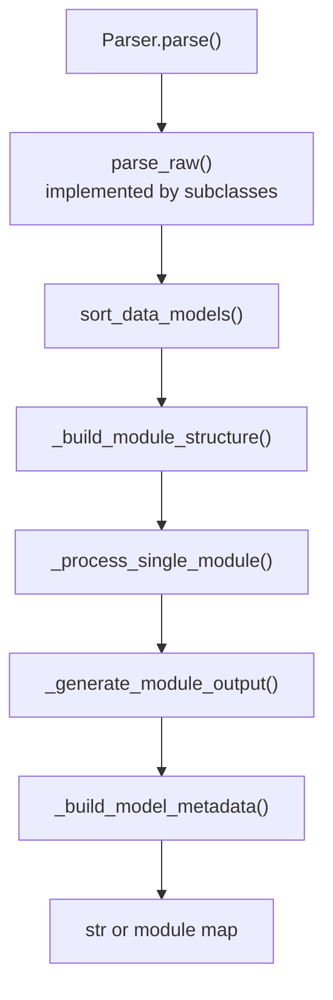
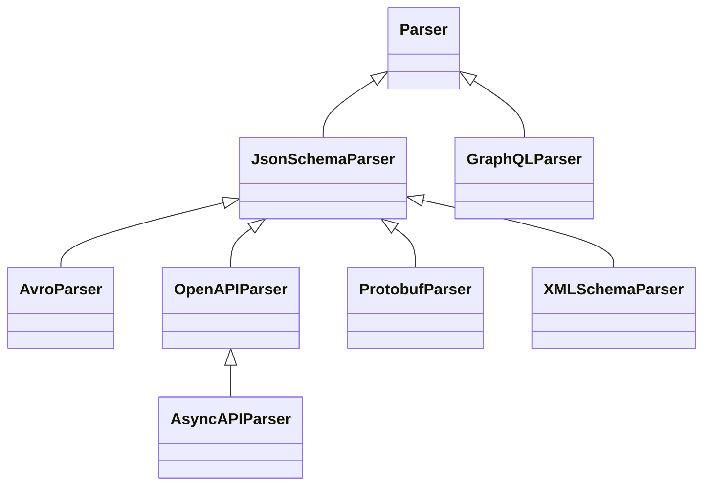
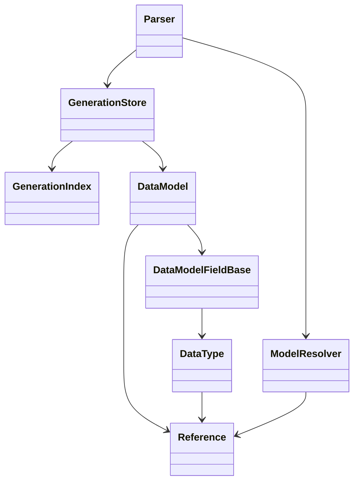

# Architecture

`datamodel-code-generator` is organized around one central idea: many input formats are normalized into a shared
generation graph, then rendered through output-model-specific backends.

This page is partly generated from source code. The generated inventory is intentionally small so the narrative can stay
hand-written while release-time details such as parser routes and output backends stay synchronized.

## Generation Pipeline

```mermaid
flowchart LR
    cli["CLI\n__main__.py"]
    api["Python API\ngenerate()"]
    config["GenerateConfig\nParserConfig"]
    normalize["Input normalization\ninfer, fetch, convert"]
    parser["Parser.parse()"]
    raw["parse_raw()\nformat-specific"]
    graph["Generation graph\nDataModel / DataType / Reference"]
    render["Templates\nmodel/template"]
    format["CodeFormatter"]
    output["Python files\nstdout / return value"]

    cli --> api
    api --> config
    config --> normalize
    normalize --> parser
    parser --> raw
    raw --> graph
    parser --> graph
    graph --> render
    render --> format
    format --> output
```

The CLI builds a `Config` from command-line arguments, `pyproject.toml`, and presets. It then calls the same
`generate()` API that library users can call directly. `generate()` selects the parser, runs it, and either returns code
or writes files.

## Entry Points

The executable entry point is defined in `pyproject.toml`:

```toml
datamodel-codegen = "datamodel_code_generator.__main__:main"
```

`src/datamodel_code_generator/__main__.py` owns CLI-only behavior:

- fast paths for `--version`, `--help`, prompt helpers, and JSON Schema output
- argument parsing and shell completion
- `pyproject.toml` profile loading and inheritance
- `--check` diff generation
- `--watch` regeneration
- structured JSON command output
- `--input-model` loading before normal generation

`src/datamodel_code_generator/__init__.py` owns the public generation API:

- `generate()`
- input type inference
- raw JSON/YAML/CSV/Dict conversion through genson
- MCP tool schema conversion
- parser construction
- generated headers and output file writing
- optional model metadata emission

## Parser Model

Each parser turns its input into `DataModel` objects. The parser-specific part is `parse_raw()`. The shared part is
`Parser.parse()`, which handles sorting, module layout, imports, rendering, exports, formatting, and optional metadata.



JSON Schema is the main reusable parser surface. OpenAPI and AsyncAPI extend it. Avro, XML Schema, Protocol Buffers,
raw data, and MCP tools convert to a JSON Schema-shaped document before using the same model-building machinery.
GraphQL is the main parser that builds models directly from its own schema API.

## Generated Inventory

<!-- BEGIN AUTO-GENERATED ARCHITECTURE INVENTORY -->
!!! note "Generated inventory"
    This section is generated by `scripts/build_architecture_docs.py` from the current source tree.
    Edit the surrounding prose by hand, then run the script before release.

### Parser Inheritance



### Input Routes

| Input file type | Parser route | Notes |
| --- | --- | --- |
| `auto` | `pre-parser inference` | Resolved before parser selection by content inference. |
| `openapi` | `OpenAPIParser` | Routed directly by `_build_parser()`. |
| `asyncapi` | `AsyncAPIParser` | Routed directly by `_build_parser()`. |
| `jsonschema` | `JsonSchemaParser` | Routed directly by `_build_parser()`. |
| `mcp-tools` | `JsonSchemaParser after conversion` | MCP tool input/output schemas are hoisted into JSON Schema definitions first. |
| `xmlschema` | `XMLSchemaParser` | Routed directly by `_build_parser()`. |
| `protobuf` | `ProtobufParser` | Routed directly by `_build_parser()`. |
| `avro` | `AvroParser` | Routed directly by `_build_parser()`. |
| `json` | `JsonSchemaParser after conversion` | Sample data is converted to JSON Schema with genson first. |
| `yaml` | `JsonSchemaParser after conversion` | Sample data is converted to JSON Schema with genson first. |
| `dict` | `JsonSchemaParser after conversion` | In-memory mapping is converted to JSON Schema with genson first. |
| `csv` | `JsonSchemaParser after conversion` | The header and first data row are converted to JSON Schema with genson first. |
| `graphql` | `GraphQLParser` | Routed directly by `_build_parser()`. |

### Output Backends

| Output model type | Data model | Root model | Field model | Type manager |
| --- | --- | --- | --- | --- |
| `pydantic_v2.BaseModel` | `model.pydantic_v2.base_model.BaseModel` | `model.pydantic_v2.root_model.RootModel` | `model.pydantic_v2.base_model.DataModelField` | `model.pydantic_v2.types.DataTypeManager` |
| `pydantic_v2.dataclass` | `model.pydantic_v2.dataclass.DataClass` | `model.type_alias.TypeAliasTypeBackport` | `model.pydantic_v2.dataclass.DataModelField` | `model.pydantic_v2.types.DataTypeManager` |
| `dataclasses.dataclass` | `model.dataclass.DataClass` | `model.type_alias.TypeAlias` | `model.dataclass.DataModelField` | `model.dataclass.DataTypeManager` |
| `typing.TypedDict` | `model.typed_dict.TypedDict` | `model.type_alias.TypeAlias` | `model.typed_dict.DataModelFieldBackport` | `model.types.DataTypeManager` |
| `msgspec.Struct` | `model.msgspec.Struct` | `model.type_alias.TypeAlias` | `model.msgspec.DataModelField` | `model.msgspec.DataTypeManager` |

### Configuration Surface

| Config model | Field count | Purpose |
| --- | ---: | --- |
| `BaseGenerateConfig` | 135 | Shared generation options. |
| `GenerateConfig` | 150 | Public `generate()` configuration. |
| `ParserConfig` | 132 | Base parser dependency injection and parser options. |
| `JSONSchemaParserConfig` | 134 | JSON Schema parser options. |
| `OpenAPIParserConfig` | 140 | OpenAPI-specific parser options. |
| `AsyncAPIParserConfig` | 141 | AsyncAPI-specific parser options. |
| `XMLSchemaParserConfig` | 135 | XML Schema-specific parser options. |
| `ProtobufParserConfig` | 135 | Protocol Buffers-specific parser options. |
| `AvroParserConfig` | 134 | Avro-specific parser options. |
| `GraphQLParserConfig` | 135 | GraphQL-specific parser options. |

### Formatter Names

| Formatter | Default when unspecified |
| --- | --- |
| `builtin` | no |
| `black` | yes |
| `isort` | yes |
| `ruff-check` | no |
| `ruff-format` | no |
<!-- END AUTO-GENERATED ARCHITECTURE INVENTORY -->

## Intermediate Model Graph

The generation graph is built from a small set of core objects:

- `DataModel`: a generated class, root model, type alias, enum, scalar alias, or union alias.
- `DataModelFieldBase`: one field on a generated model, including defaults, aliases, constraints, and metadata.
- `DataType`: a Python type annotation tree, including containers, unions, literals, generated-model references, and
  imports.
- `Reference`: a schema reference path and generated Python name.
- `GenerationStore`: the parser-owned model list plus a query index over model and type dependencies.



`GenerationStore` is the preferred mutation boundary for parser-side changes that affect dependency facts. Parser code
should register models and update references, fields, bases, names, and paths through store methods instead of mutating
the live objects directly. `GenerationIndex` rebuilds stable facts from the model list and gives later phases efficient
queries such as "which data types point at this reference?".

## References And Names

`ModelResolver` is the naming and reference authority. It tracks the current root, base path, base URL, root IDs, and
known references while parsers traverse documents. It also applies naming options such as aliases, `model_name_map`,
prefixes, suffixes, duplicate suffixes, enum member normalization, and field name safety.

`Reference.children` still links references back to users, but newer parser post-processing should prefer
`GenerationIndex` when it needs dependency facts. The index is rebuilt from live models and avoids depending on legacy
side effects alone.

## Output Backends

Parsers do not hard-code Pydantic, dataclass, TypedDict, or msgspec classes. `get_data_model_types()` returns a
`DataModelSet` for the selected `DataModelType`. That set injects:

- the model class
- the root model or type alias class
- the field class
- the type manager
- optional reference dumping behavior
- GraphQL scalar and union model classes

The same parser output can therefore render into different Python model styles while sharing the same reference and
module-generation pipeline.

## Rendering And Formatting

Every `DataModel` renders through a Jinja2 template. Built-in templates live in
`src/datamodel_code_generator/model/template`. A custom template directory can override a built-in template by path.

Imports are collected separately from rendering through `Import` and `Imports`. The import layer handles grouping,
aliases, reference-bound imports, future imports, unused import removal, and `__all__` generation.

`CodeFormatter` then applies the configured formatter pipeline. The formatter layer supports the built-in formatter,
black, isort, ruff check, ruff format, and user-supplied custom formatters.

## Metadata Output

When `--emit-model-metadata` is enabled, `Parser.parse()` records source-reference information while producing models.
`generate()` then serializes the resulting payload through `model_metadata.py`. The JSON Schema for that payload is
stored in `src/datamodel_code_generator/resources/model_metadata.schema.json` and exposed through
`--output-format-json-schema model-metadata`.

## Runtime Dynamic Models

`generate_dynamic_models()` uses the normal `generate()` API to produce code, executes that code in temporary modules,
and returns real Pydantic v2 model classes. Multi-module output is topologically sorted by relative imports before
execution. The result is cached by schema and config hash when caching is enabled.

## Performance-Sensitive Paths

Recent work has focused on reducing work without changing the generation model:

- fast CLI paths avoid importing heavy modules
- `format.py` keeps format-related types in a lighter helper module
- local schema sources are reused during `$ref` resolution
- YAML unsupported-tag scanning is skipped when no unsupported tag marker is present
- JSON Schema constraint extraction avoids dumping whole schema objects when only selected constraint keys are needed
- simple field import collection avoids rendering a full type hint when `DataType` facts are sufficient

These optimizations keep the architecture stable: parsers still build the same graph, and renderers still produce the
same code, but hot paths do less incidental work.

## Keeping This Page Synchronized

Run this before release or whenever parser routes, output backends, config models, or formatter names change:

```bash
python scripts/build_architecture_docs.py
```

CI can validate the generated section without rewriting files:

```bash
python scripts/build_architecture_docs.py --check
```

The repository test suite includes this check through `tests/test_build_architecture_docs_script.py`, so pull requests
fail when the generated inventory is stale. The `generated-docs` tox environment also runs this script before
`build_llms_txt.py`, which keeps the architecture page and LLM documentation in the same release-time sync flow.
