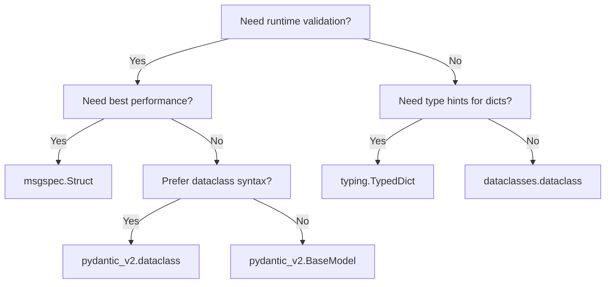

<!-- related-cli-options: --output-model-type, --frozen-dataclasses, --keyword-only, --dataclass-arguments, --target-python-version -->

# Output Model Types

datamodel-code-generator supports multiple output model types. This page compares them to help you choose the right one for your project.

## Quick Comparison

| Model Type | Validation | Serialization | Performance | Use Case |
|------------|------------|---------------|-------------|----------|
| **Pydantic v2** | Runtime | Built-in | Fast | New projects, APIs, data validation |
| **Pydantic v2 dataclass** | Runtime | Built-in | Fast | Pydantic validation with dataclass syntax |
| **dataclasses** | None | Manual | Fastest | Simple data containers, no validation needed |
| **TypedDict** | Static only | Dict-compatible | N/A | Type hints for dicts, JSON APIs |
| **msgspec** | Runtime | Built-in | Fastest | High-performance serialization |

---

## Pydantic v2 (Recommended)

**Use `--output-model-type pydantic_v2.BaseModel`**

Pydantic v2 is recommended for new projects. It offers better performance and a modern API.

```bash
datamodel-codegen --input schema.json --output-model-type pydantic_v2.BaseModel --output model.py
```

```python
from pydantic import BaseModel, Field, RootModel

class Pet(BaseModel):
    id: int = Field(..., ge=0)
    name: str = Field(..., max_length=256)
    tag: str | None = None

class Pets(RootModel[list[Pet]]):
    root: list[Pet]
```

### When to use

- New projects requiring data validation
- APIs requiring data validation
- Projects needing JSON Schema generation from models

---

## Pydantic v2 dataclass

**Use `--output-model-type pydantic_v2.dataclass`**

Pydantic v2 dataclass combines the familiar dataclass syntax with Pydantic's validation capabilities.

```bash
datamodel-codegen --input schema.json --output-model-type pydantic_v2.dataclass --output model.py
```

```python
from pydantic.dataclasses import dataclass
from typing import Optional

@dataclass
class Pet:
    id: int
    name: str
    tag: Optional[str] = None
```

### When to use

- Want to use dataclass syntax with Pydantic validation
- Migrating from dataclasses but need validation
- Prefer decorator-based class definition

---

## dataclasses

**Use `--output-model-type dataclasses.dataclass`**

Python's built-in dataclasses for simple data containers without runtime validation.

```bash
datamodel-codegen --input schema.json --output-model-type dataclasses.dataclass --output model.py
```

```python
from dataclasses import dataclass
from typing import Optional

@dataclass
class Pet:
    id: int
    name: str
    tag: Optional[str] = None
```

### Options for dataclasses

| Option | Description |
|--------|-------------|
| `--frozen-dataclasses` | Generate immutable dataclasses (`frozen=True`) |
| `--keyword-only` | Require keyword arguments (`kw_only=True`, Python 3.10+) |
| `--dataclass-arguments` | Custom decorator arguments as JSON |

```bash
# Frozen, keyword-only dataclasses
datamodel-codegen --input schema.json --output-model-type dataclasses.dataclass \
  --frozen-dataclasses --keyword-only --target-python-version 3.10
```

### When to use

- Simple data structures without validation needs
- Performance-critical code where validation overhead matters
- Interoperability with code expecting dataclasses

---

## TypedDict

**Use `--output-model-type typing.TypedDict`**

TypedDict provides static type checking for dictionary structures.

```bash
datamodel-codegen --input schema.json --output-model-type typing.TypedDict --output model.py
```

```python
from typing import TypedDict, NotRequired

class Pet(TypedDict):
    id: int
    name: str
    tag: NotRequired[str]
```

### When to use

- Working with JSON APIs where data remains as dicts
- Static type checking without runtime overhead
- Gradual typing of existing dict-based code

### Boundary payloads and partial updates

TypedDict is a good fit for data at an HTTP boundary. A PATCH payload can
distinguish three cases:

- the key is missing, so the existing value should stay unchanged
- the key is present with `null`, so the value should be cleared
- the key is present with a value, so the value should be replaced

Use `--strict-nullable` when the difference between a missing key and a
nullable value matters:

```bash
datamodel-codegen --input user-patch.schema.json \
  --output-model-type typing.TypedDict \
  --strict-nullable \
  --target-python-version 3.13 \
  --output model.py
```

```json
{
  "$schema": "https://json-schema.org/draft/2020-12/schema",
  "title": "UserPatch",
  "type": "object",
  "required": ["id"],
  "properties": {
    "id": {"type": "string", "readOnly": true},
    "nickname": {"type": ["string", "null"]},
    "bio": {"type": "string"}
  },
  "additionalProperties": false
}
```

```python
from typing import NotRequired
from typing_extensions import TypedDict

class UserPatch(TypedDict, closed=True):
    id: str
    nickname: NotRequired[str | None]
    bio: NotRequired[str]
```

Here `nickname: NotRequired[str | None]` means the key may be omitted, and
`None` is still a real value when the key is present. This follows
[PEP 655](https://peps.python.org/pep-0655/), which added `Required` and
`NotRequired` for per-key presence in TypedDict.

If the schema marks response-only fields with `readOnly`, combine this with
`--use-frozen-field` to generate `ReadOnly` for TypedDict output:

```bash
datamodel-codegen --input user-patch.schema.json \
  --output-model-type typing.TypedDict \
  --strict-nullable \
  --use-frozen-field \
  --target-python-version 3.13 \
  --output model.py
```

```python
from typing import NotRequired, ReadOnly
from typing_extensions import TypedDict

class UserPatch(TypedDict, closed=True):
    id: ReadOnly[str]
    nickname: NotRequired[str | None]
    bio: NotRequired[str]
```

`ReadOnly` comes from [PEP 705](https://peps.python.org/pep-0705/). The
`closed=True` output comes from [PEP 728](https://peps.python.org/pep-0728/)
and represents `additionalProperties: false` for type checkers that understand
closed TypedDicts.

!!! note "Background"
    The distinction between missing keys, `None`, and unset update arguments is
    covered in Koudai Aono's PyCon US 2026 talk
    [Beyond Optional in Real-World Projects](https://github.com/koxudaxi/pyconus_2026/blob/main/slides.md).
    In datamodel-code-generator today, TypedDict and msgspec preserve that
    boundary shape most directly. Pydantic models and dataclasses are usually a
    better fit after the boundary has been normalized into application data.

---

## msgspec

**Use `--output-model-type msgspec.Struct`**

[msgspec](https://github.com/jcrist/msgspec) offers high-performance serialization with validation.

```bash
pip install 'datamodel-code-generator[msgspec]'
datamodel-codegen --input schema.json --output-model-type msgspec.Struct --output model.py
```

```python
from msgspec import Struct, field
from typing import Union, UnsetType
from msgspec import UNSET

class Pet(Struct):
    id: int
    name: str
    tag: Union[str, UnsetType] = UNSET
```

### When to use

- High-performance JSON/MessagePack serialization
- Memory-efficient data structures
- APIs with strict performance requirements

---

## Choosing the Right Type



### Decision Guide

1. **API with validation** → Pydantic v2
2. **Validation with dataclass syntax** → Pydantic v2 dataclass
3. **High-performance serialization** → msgspec
4. **Simple data containers** → dataclasses
5. **Dict-based JSON handling** → TypedDict

---

## See Also

- [CLI Reference: `--output-model-type`](cli-reference/model-customization.md#output-model-type)
- [CLI Reference: `--strict-nullable`](cli-reference/model-customization.md#strict-nullable)
- [CLI Reference: `--use-frozen-field`](cli-reference/model-customization.md#use-frozen-field)
- [CLI Reference: Model Customization](cli-reference/model-customization.md)
- [Pydantic Documentation](https://docs.pydantic.dev/)
- [msgspec Documentation](https://jcristharif.com/msgspec/)
