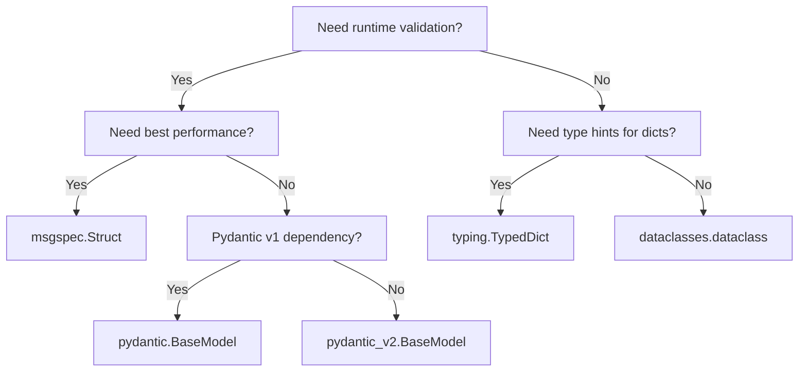

<!-- related-cli-options: --output-model-type, --frozen-dataclasses, --keyword-only, --dataclass-arguments, --target-python-version -->

# Output Model Types

datamodel-code-generator supports multiple output model types. This page compares them to help you choose the right one for your project.

## Quick Comparison

| Model Type | Validation | Serialization | Performance | Use Case |
|------------|------------|---------------|-------------|----------|
| **Pydantic v2** | Runtime | Built-in | Fast | New projects, APIs, data validation |
| **Pydantic v1** | Runtime | Built-in | Moderate | Legacy compatibility |
| **dataclasses** | None | Manual | Fastest | Simple data containers, no validation needed |
| **TypedDict** | Static only | Dict-compatible | N/A | Type hints for dicts, JSON APIs |
| **msgspec** | Runtime | Built-in | Fastest | High-performance serialization |

---

## Pydantic v2 (Recommended)

**Use `--output-model-type pydantic_v2.BaseModel`**

Pydantic v2 is recommended for new projects. It offers better performance and a modern API.

```bash
datamodel-codegen --input schema.json --output-model-type pydantic_v2.BaseModel --output model.py
```

```python
from pydantic import BaseModel, Field, RootModel

class Pet(BaseModel):
    id: int = Field(..., ge=0)
    name: str = Field(..., max_length=256)
    tag: str | None = None

class Pets(RootModel[list[Pet]]):
    root: list[Pet]
```

### When to use

- New projects without Pydantic v1 dependencies
- APIs requiring data validation
- Projects needing JSON Schema generation from models

---

## Pydantic v1

**Use `--output-model-type pydantic.BaseModel`** (default)

Pydantic v1 is the default for backward compatibility with existing codebases.

```bash
datamodel-codegen --input schema.json --output-model-type pydantic.BaseModel --output model.py
```

```python
from pydantic import BaseModel, Field

class Pet(BaseModel):
    id: int = Field(..., ge=0)
    name: str = Field(..., max_length=256)
    tag: Optional[str] = None

class Pets(BaseModel):
    __root__: List[Pet]
```

### Migration from v1 to v2

Key differences when migrating:

| v1 | v2 | Notes |
|----|----|----|
| `__root__` | `RootModel` | Custom root types now use `RootModel` class |
| `const` | Removed | Use `Literal` types instead |
| `min_items` | `min_length` | |
| `max_items` | `max_length` | |
| `unique_items` | Removed | List replaced by `set` type |
| `allow_mutation` | `frozen` | Inverse value |
| `regex` | `pattern` | |
| `pydantic.Config` | `pydantic.ConfigDict` | |

See [Pydantic v2 Migration Guide](https://docs.pydantic.dev/2.0/migration/) for details.

---

## dataclasses

**Use `--output-model-type dataclasses.dataclass`**

Python's built-in dataclasses for simple data containers without runtime validation.

```bash
datamodel-codegen --input schema.json --output-model-type dataclasses.dataclass --output model.py
```

```python
from dataclasses import dataclass
from typing import Optional

@dataclass
class Pet:
    id: int
    name: str
    tag: Optional[str] = None
```

### Options for dataclasses

| Option | Description |
|--------|-------------|
| `--frozen-dataclasses` | Generate immutable dataclasses (`frozen=True`) |
| `--keyword-only` | Require keyword arguments (`kw_only=True`, Python 3.10+) |
| `--dataclass-arguments` | Custom decorator arguments as JSON |

```bash
# Frozen, keyword-only dataclasses
datamodel-codegen --input schema.json --output-model-type dataclasses.dataclass \
  --frozen-dataclasses --keyword-only --target-python-version 3.10
```

### When to use

- Simple data structures without validation needs
- Performance-critical code where validation overhead matters
- Interoperability with code expecting dataclasses

---

## TypedDict

**Use `--output-model-type typing.TypedDict`**

TypedDict provides static type checking for dictionary structures.

```bash
datamodel-codegen --input schema.json --output-model-type typing.TypedDict --output model.py
```

```python
from typing import TypedDict, NotRequired

class Pet(TypedDict):
    id: int
    name: str
    tag: NotRequired[str]
```

### When to use

- Working with JSON APIs where data remains as dicts
- Static type checking without runtime overhead
- Gradual typing of existing dict-based code

---

## msgspec

**Use `--output-model-type msgspec.Struct`**

[msgspec](https://github.com/jcrist/msgspec) offers high-performance serialization with validation.

```bash
pip install 'datamodel-code-generator[msgspec]'
datamodel-codegen --input schema.json --output-model-type msgspec.Struct --output model.py
```

```python
from msgspec import Struct, field
from typing import Union, UnsetType
from msgspec import UNSET

class Pet(Struct):
    id: int
    name: str
    tag: Union[str, UnsetType] = UNSET
```

### When to use

- High-performance JSON/MessagePack serialization
- Memory-efficient data structures
- APIs with strict performance requirements

---

## Choosing the Right Type



### Decision Guide

1. **API with validation** → Pydantic v2
2. **Legacy Pydantic v1 project** → Pydantic v1
3. **High-performance serialization** → msgspec
4. **Simple data containers** → dataclasses
5. **Dict-based JSON handling** → TypedDict

---

## See Also

- [CLI Reference: `--output-model-type`](cli-reference/model-customization.md#output-model-type)
- [CLI Reference: Model Customization](cli-reference/model-customization.md)
- [Pydantic Documentation](https://docs.pydantic.dev/)
- [msgspec Documentation](https://jcristharif.com/msgspec/)
